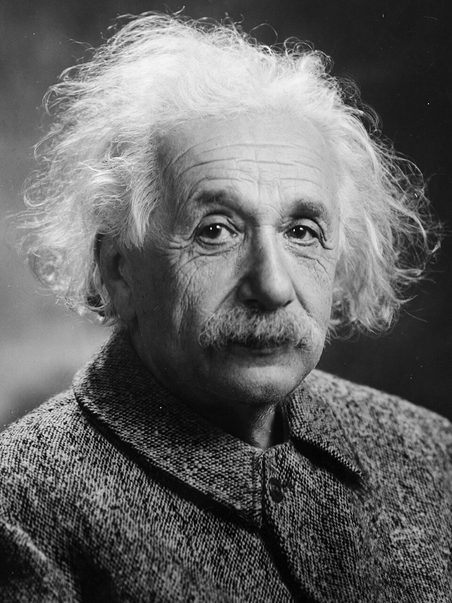
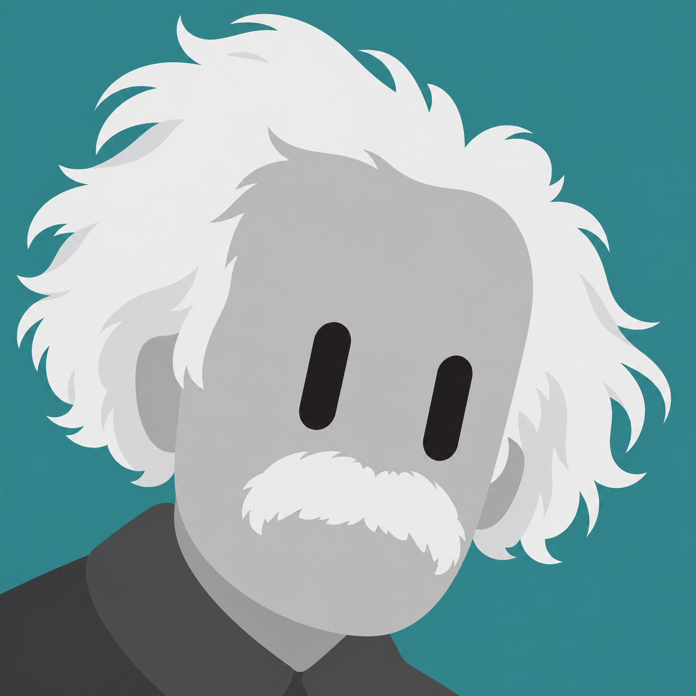
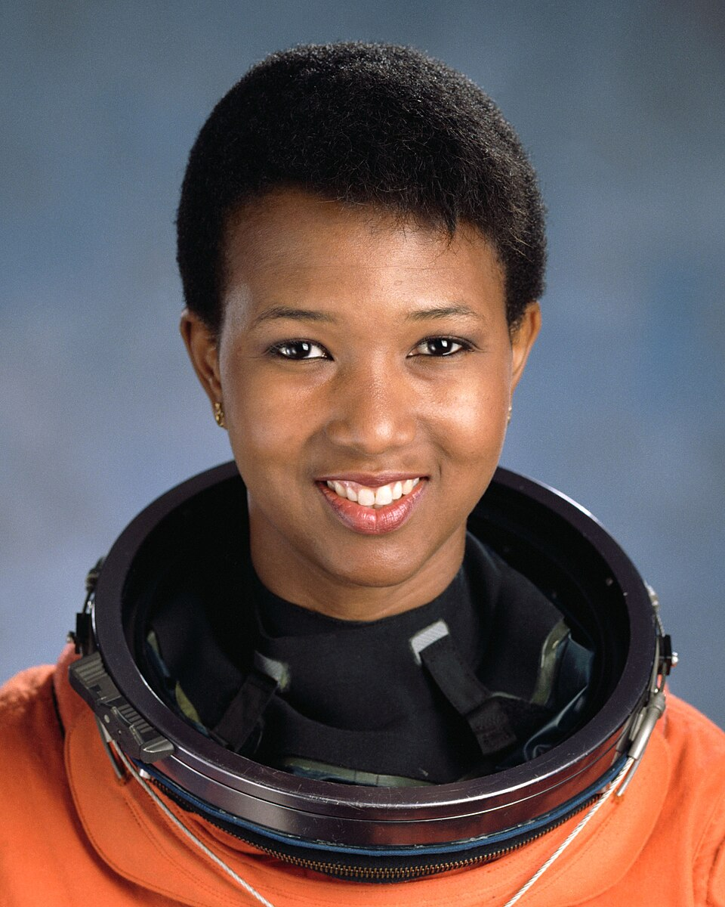
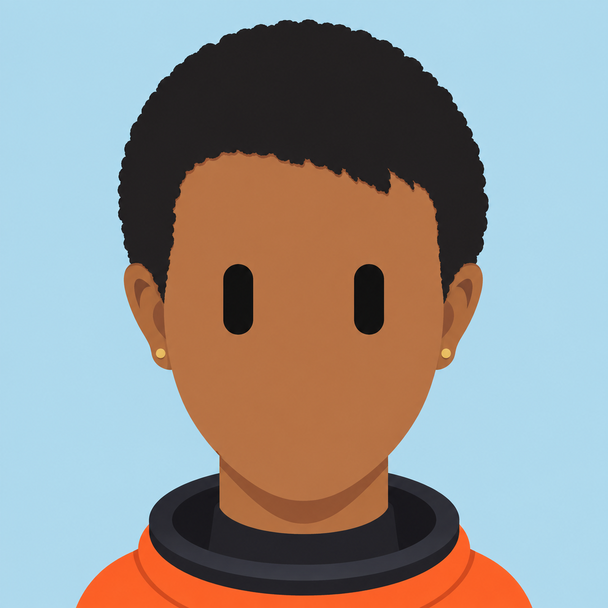
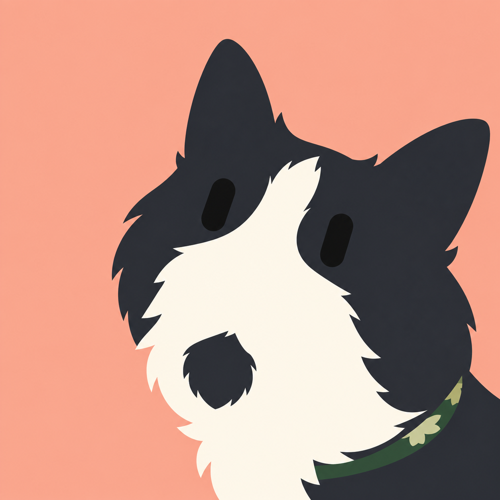
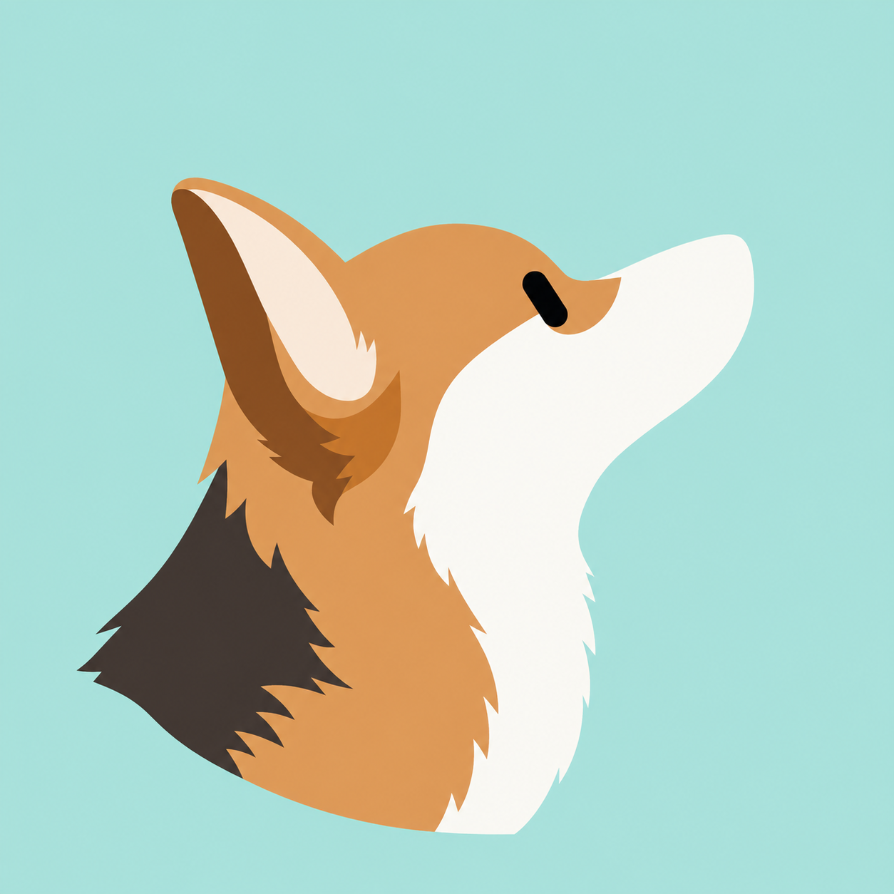

# 原图 → 极简机器人头像

4 个公开来源案例，覆盖两个人物、一只黑白猫和一只三色柯基。全部采用黑色胶囊眼、无鼻嘴；保留原照片中可观察到的轮廓、颜色和标志细节。背景用于拉开对比，不以换肤色、换毛色换取统一配色。

以下是实际生成结果与视觉检查记录，不是身份识别盲测，也不代表每个案例都达到了“一眼认出同一个主体”。生成时间：2026-09-26；工具：Codex 内置图像生成/编辑工具。

## 01 · 白发与胡须：爱因斯坦

| 参考照片 | 生成头像 |
| --- | --- |
|  |  |

- **保留重点**：高额头、向两侧蓬开的白发、下垂的宽白胡须、相对较长的脸型。参考图是黑白照片，人物保留灰度，不声称还原真实肤色。
- **构图**：左侧探入、顺时针倾斜；青绿色背景与白发拉开对比。
- **检查结果**：白发、胡须、高额头组合较明显；发型和脸颊被美化简化，不能据此声称精确还原面部。
- [完整生成提示词](einstein/prompt.md) · [原图来源](https://commons.wikimedia.org/wiki/File:Albert_Einstein_Head.jpg)

## 02 · 短卷发与肤色：梅·杰米森

| 参考照片 | 生成头像 |
| --- | --- |
|  |  |

- **保留重点**：紧凑的短黑卷发、暖棕肤色、较长的椭圆脸、金色耳钉，以及少量橙色衣领和深色颈环。
- **构图**：居中、正面、头部摆正；浅蓝背景提供冷暖对比。
- **检查结果**：发型、肤色、耳钉和衣领被保留。鼻嘴与原眼形省略后，人物个体辨识仍有限；衣领提示职业形象，不能把这一点当作人物身份已被准确识别。
- [完整生成提示词](mae-jemison/prompt.md) · [原图来源](https://commons.wikimedia.org/wiki/File:Mae_Carol_Jemison_(cropped_2).jpg)

## 03 · 不规则白斑与黑下巴：黑白猫 Charlotte

| 参考照片 | 生成头像 |
| --- | --- |
|  |  |

- **保留重点**：黑色头顶和两侧脸颊、额头延伸到口鼻区域的不规则白斑、下巴独立黑斑、不同外形的两只耳朵及少量绿色项圈。
- **构图**：主体偏右，左侧留白；珊瑚色背景衬托黑白毛色。
- **检查结果**：白斑和下巴黑斑得到保留；一次修正后毛边更简洁、黑斑下移，但仍可能被误读为鼻子。提示词要求的逆时针倾斜没有准确执行，当前结果仍呈顺时针倾斜；不能把本例算作角度控制完全通过。
- [初始提示词](tuxedo-cat/prompt.md) · [定向修正提示词](tuxedo-cat/revision-prompt.md) · [原图来源](https://commons.wikimedia.org/wiki/File:Bicolor_tuxedo_cat.jpg)

## 04 · 侧脸与三色分区：柯基

| 参考照片 | 生成头像 |
| --- | --- |
|  |  |

- **保留重点**：向右上仰的侧脸、大立耳、棕色头颈、白色吻部与喉部、后颈深色区域。保留源照片可见的侧面，不从这一张图补造正脸。
- **构图**：侧脸抬头；远侧眼自然不可见，因此只画一只胶囊眼；薄荷色背景衬托棕白毛色。
- **检查结果**：姿态、立耳、长吻轮廓和三色关系被保留，定向修正去掉了模型误加的额头白条。吻部比例仍有夸张，鼻嘴省略后主要体现犬种和姿态，尚不足以证明可以识别到同一只狗。
- [初始提示词](corgi/prompt.md) · [定向修正提示词](corgi/revision-prompt.md) · [原图来源与 CC BY-SA 3.0 许可](https://commons.wikimedia.org/wiki/File:Pembroke_Welsh_Corgi.jpg)

## 本轮对技能的调整

1. 取消“最多三个特征”的硬上限，生成前填写具体特征清单。
2. 保留人物脸型比例、发际线、眼镜/胡须，以及宠物耳形、毛色位置与不对称分区。
3. 不为统一配色漂白肤色、替换毛色或添加目标没有的浅色眼圈；优先调整背景形成对比。
4. 生成后对照原图逐项检查，区分“同类主体”与“同一主体”。
5. 保留无鼻嘴规则和可变构图；单次定向修正仍有偏差时如实记录，不无限重试。

所有图片的作者、原始链接、权利状态及修改说明见 [SOURCES.md](SOURCES.md)。未使用用户的私人照片作为公开案例。案例中的文字说明不绘制进头像。
