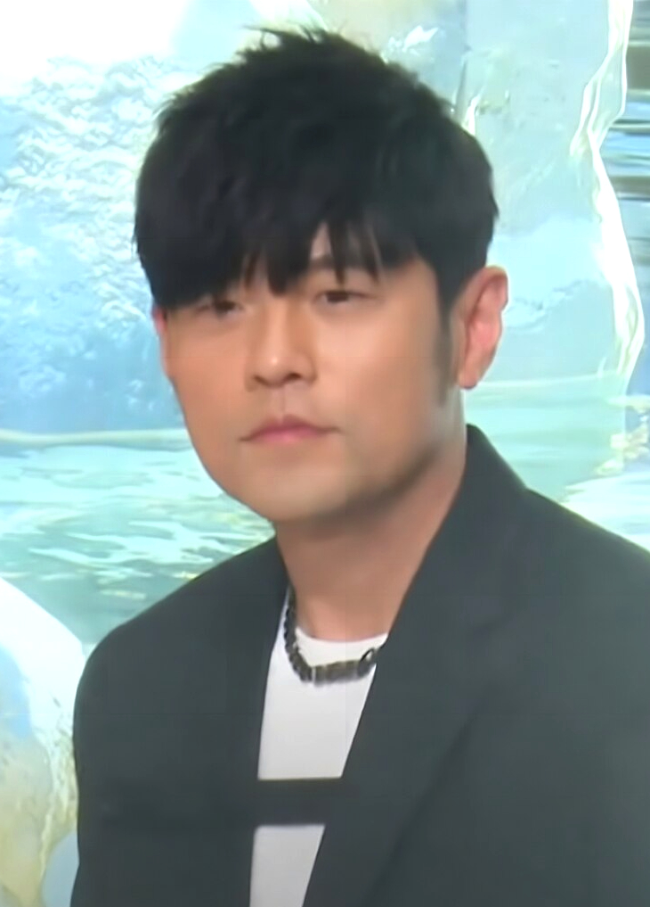
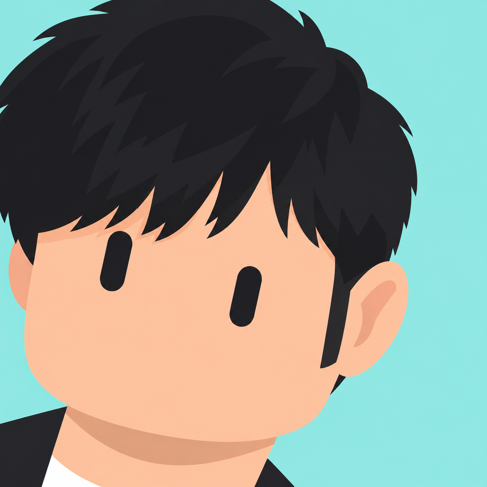
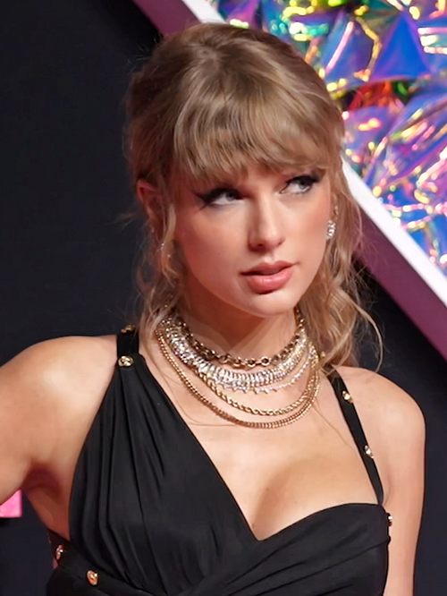
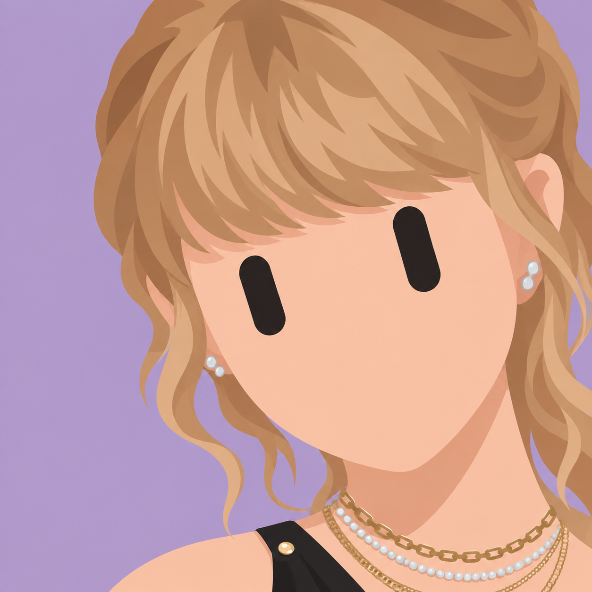
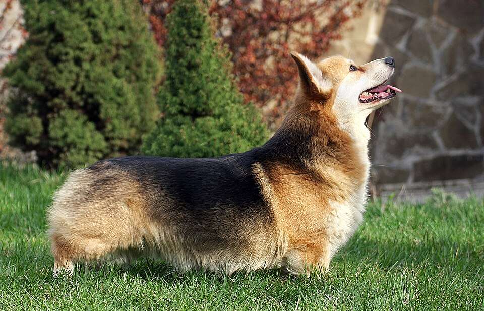
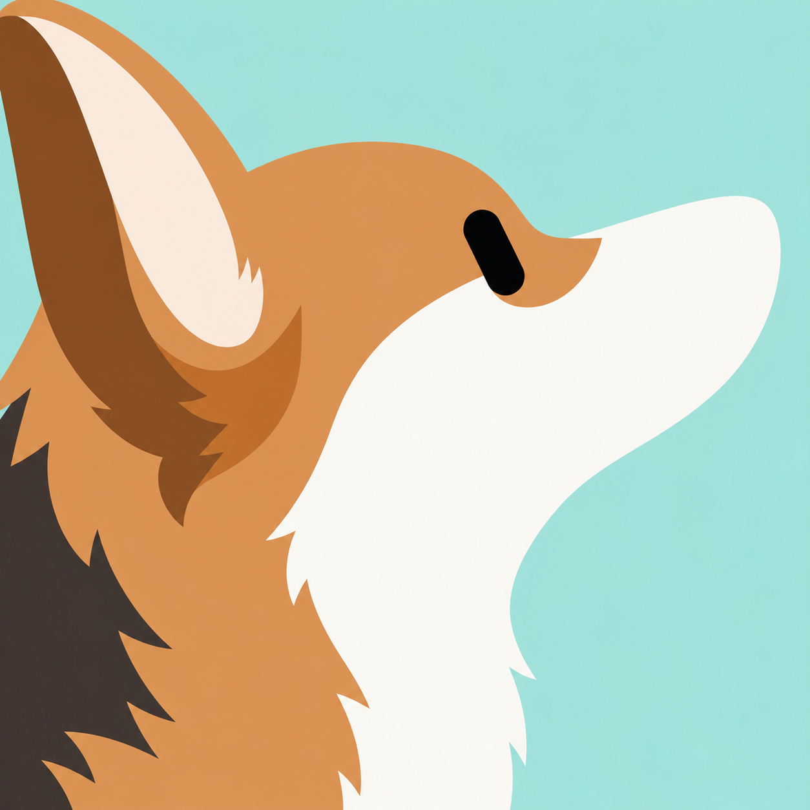
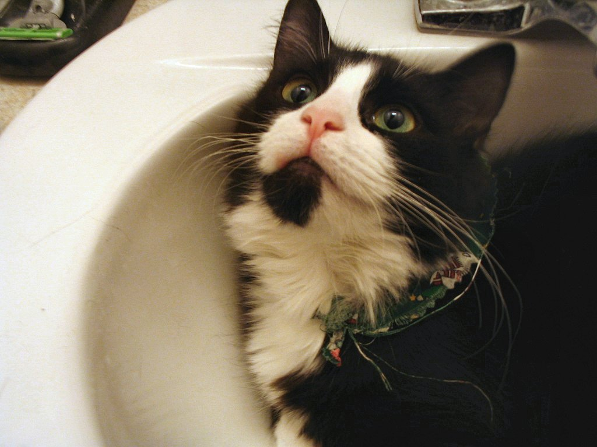
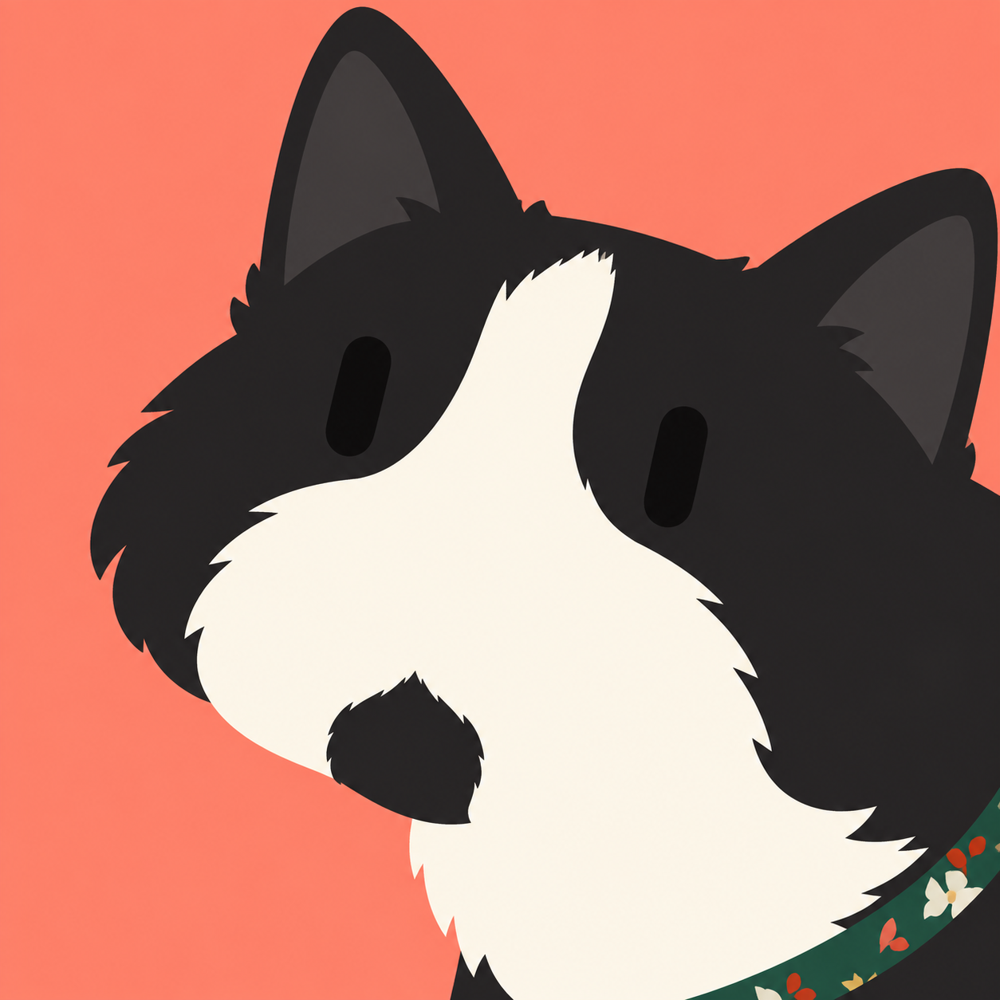

# 原图 → 极简机器人头像

当前重点测试彩色当代人物，以及从画外探入的宠物构图。目标是保留照片中同一个主体的特征；以下是实际结果，不等于已经通过“一眼认出”的识别测试。生成日期：2026-09-26，工具：Codex 内置图像生成/编辑。

## 周杰伦 · 发型、鬓角与脸型

| 参考照片 | 当前结果 |
| --- | --- |
|  |  |

保留重点：不对称长刘海、蓬松黑发、较长鬓角、偏方的下颌和暖肤色。浅青背景拉开对比，不把脸变灰。修正已移除多余眉毛并调整为顺时针倾斜；头发跨左边、颈部出底边。无鼻嘴后个体辨识仍有限，不能把“相似发型”当作已经认出本人。

[生成提示词](jay-chou/prompt.md) · [修正提示词](jay-chou/revision-prompt.md) · [来源](https://commons.wikimedia.org/wiki/File:Jay_Chou_in_Shanghai_2023_(3).jpg)

## Taylor Swift · 金色刘海、盘发与脸型

| 参考照片 | 当前结果 |
| --- | --- |
|  |  |

保留重点：金色侧扫刘海、收起的头发与侧面松散发束、偏长的脸型、小耳饰、暖肤色。右侧探入、逆时针倾斜，发部与颈部延伸出画。紫色背景与暖色人物形成对比。

实际偏差：脸型仍被明显美化，项链过于繁复、装饰细节不够忠实；发型与配色得到保留，但不作为已通过个体辨识的案例。

[生成提示词](taylor-swift/prompt.md) · [来源](https://commons.wikimedia.org/wiki/File:Taylor_Swift_at_the_2023_MTV_Video_Music_Awards_4.png)

## 柯基 · 从左向右延伸

| 参考照片 | 修改后 |
| --- | --- |
|  |  |

这次在[上一版](corgi/avatar.png)上修改：头颈跨越左边界、喉部延伸到底边，消除悬空胸像感；保留向右上看的侧脸、立耳与棕白黑分区。纯侧脸只显示一只胶囊眼。

实际偏差：吻部仍偏长，更多保留了犬种、毛色和姿态，不能视为同一只狗的识别验证。

[本轮编辑提示词](corgi/prompt-v2.md) · [来源及 CC BY-SA 3.0](https://commons.wikimedia.org/wiki/File:Pembroke_Welsh_Corgi.jpg)

## 未通过测试：黑白猫

| 参考照片 | 第二轮结果 |
| --- | --- |
|  |  |

虽然保留了黑白分区和项圈，但脸部仍被拉长，耳朵偏大，下巴黑斑像鼻头，逆时针要求也未执行。**不能作为成功的猫头像示范。** 本例用来说明仅在提示词中增加物种比例要求，并不能保证模型执行正确。

[本轮提示词](tuxedo-cat/prompt-v2.md) · [来源](https://commons.wikimedia.org/wiki/File:Bicolor_tuxedo_cat.jpg)

## 技能本轮增加的要求

- 宠物先核对颅脸长宽、吻部长短、耳朵比例和毛色边界，避免猫犬套同一轮廓。
- 探入构图必须与画外连续：左进跨左边及底边，右进跨右边及底边；不画悬浮贴纸或截断底座。
- 彩色人物优先保留自然肤色和可见发型、脸型差异，用背景改善对比。
- 特征保留与真实辨识分开评估；不达标的结果明确标记。

[早期测试：爱因斯坦、梅·杰米森及宠物第一版](EARLIER-TESTS.md)。黑白人物保留为历史测试，不作为彩色头像的主示范。

[全部图片来源与许可](SOURCES.md) · [生成记录与文件校验](manifest.json)。未使用用户私人照片作为公开案例。
